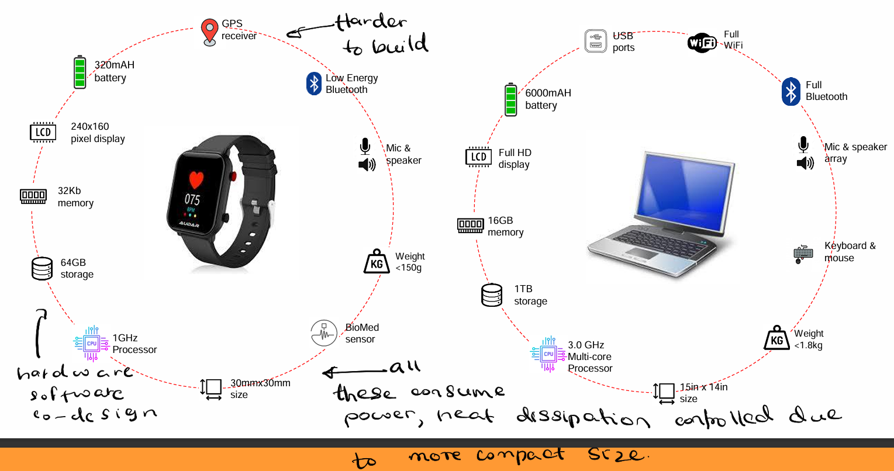

# <u>2. Anatomy of a “Thing”</u>

| **Characteristic**           | **Description**                                              | **Example**                                                  |
| ---------------------------- | ------------------------------------------------------------ | ------------------------------------------------------------ |
| **Realtime Response**        | The system must react instantly to changes or inputs.        | Robotic arms in automation reacting to sensor inputs.        |
| **Low Power Operation**      | Designed to work with minimal energy consumption.            | Smart meters running on battery power.                       |
| **Harsh Environment**        | Must function under extreme conditions like humidity, dust, and vibrations. | Sensors in oil rigs or space probes.                         |
| **Failsafe Operation**       | Prevents or minimizes failures to maintain safety.           | Autopilot taking control in an aircraft emergency.           |
| **Limited Resources**        | Operates with constraints in memory, processing power, or bandwidth. | Smartwatches performing tasks with limited CPU and RAM.      |
| **Unreliable Communication** | Works even with weak or intermittent network connectivity.   | Satellites communicating with Earth with delays.             |
| **Self-Configurable**        | Can adapt and reconfigure itself dynamically.                | Smart traffic lights adjusting timing based on traffic flow. |

### <u>Smart Watch Example</u>

### <u>Traditional Computer vs IoT devices</u>

-  **IoT (Internet of Things) devices are computer-based** in the sense that they contain processors, memory, and software that allow them to collect, process, and transmit data over the internet or a network. However, they are usually more specialized and resource-constrained compared to traditional computers.
- IoT devices can range from simple sensors to complex embedded systems, including:
  - **Smart home devices** (e.g., smart thermostats, security cameras)
  - **Wearables** (e.g., smartwatches, fitness trackers)
  - **Industrial IoT (IIoT) devices** (e.g., factory automation sensors, predictive maintenance systems)
  - **Medical IoT devices** (e.g., remote health monitors, smart insulin pumps)
  - **Automotive IoT** (e.g., smart GPS, connected car systems)
- They typically run on embedded operating systems like `FreeRTOS`, `Zephyr`, or `Linux-based OS` (e.g., Raspberry Pi OS) and communicate using protocols like `MQTT`, `CoAP`, or `HTTP`.

#### <u>Computer Motherboard</u>

A complex system designed for high-performance computing, multitasking, and large data processing.

**Main Components:**

- **CPU (Central Processing Unit):** Executes instructions.
- **Clock Chip:** Synchronizes operations.
- **Northbridge (Memory Controller Hub):** Manages high-speed communication between CPU, RAM, and GPU.
- **Southbridge (I/O Controller Hub):** Handles slower peripherals like USB, SATA, and PCI slots.
- **BIOS (Basic Input/Output System):** Stores firmware for booting and hardware initialization.
- **Super I/O:** Manages legacy I/O devices like keyboards, mouse, and serial ports.

**High-Speed Region:**

- Fast processing between CPU, RAM, and GPU.
- Uses **Northbridge** for memory management.
- **PCI-E / AGP slots** for accelerated graphics.

**Medium-Speed Region:**

- Southbridge manages **I/O devices** like storage (SATA), onboard graphics, and Ethernet.

**Low-Speed Region:**

- Slower peripherals like keyboards, USB ports, and legacy devices.
- **Super I/O** and BIOS handle essential functions.

#### <u>Microcontroller IC</u>

A simpler, integrated system designed for **specific tasks**, commonly found in **IoT devices** and embedded applications.

**Main Components:**

- **CPU:** Executes instructions.
- **Clock & Power Management:** Controls timing and power regulation.
- **Flash Memory:** Stores program code (firmware).
- **SRAM (Static RAM):** Temporary data storage.
- **Interrupt Logic:** Handles event triggers.
- **Digital I/O & Analog I/O:** Interfaces for sensors, actuators, and other hardware.
- **Supervisory Circuits:** Monitors system health and resets if needed.

**Key Points:**

- **Simple Architecture** – All components are interconnected.
- **Power Conditioning** – Adjusts for voltage and temperature changes.
- **Essential for IoT Devices** – Provides real-time automation and monitoring.

### <u>Microprocessors vs Microcontrollers</u>

### <u>Some popular microcontrollers</u>

### <u>Microcontroller as a SoC</u>

#### <u>Early Attempts</u>

#### <u>AVR Microcontroller</u>

#### <u>Esp8266</u>

#### <u>Esp32</u>

### <u>Software on a "Thing"</u>

#### <u>Software vs Hardware Implementation</u>

####  <u>Developing a "Thing"</u>

##### <u>Arduino</u>

##### <u>NodeMCU</u>

