# 								IOT Software


## PC Vs IOT Devices

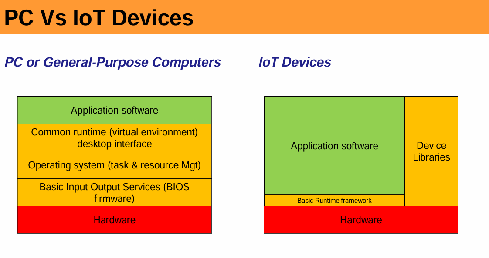

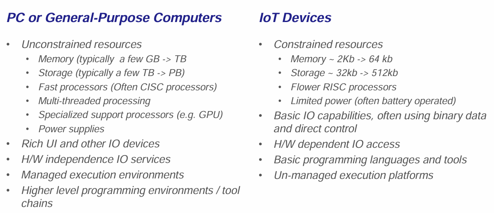


### **1. General-Purpose Computers (PCs)**

PCs are designed for a wide range of tasks, such as software development, gaming, browsing, and multimedia processing. Their architecture is more complex to support multi-tasking and a variety of applications.

**PC Software and System Components:**

- **Application Software:** Runs user applications like browsers, word processors, games, and development tools.
- **Common Runtime Environment:** Supports virtual environments and desktop interfaces (e.g., Windows Explorer, macOS GUI).
- **Operating System (OS):** Handles task management, memory allocation, security, and hardware abstraction. Examples: Windows, Linux, macOS.
- **BIOS/Firmware (Basic Input/Output System):** Initializes hardware at startup and loads the OS. Helps to get rid of the difficulty of managing hardware.
- **Hardware:** Includes CPU, RAM, storage, GPU, motherboard, and peripherals.

**Key Characteristics of PCs:**

 ✔ Designed for versatility and high performance.
 ✔ Multi-tasking and multi-user capabilities.
 ✔ High processing power, memory, and storage.
 ✔ Supports heavy applications like video editing and AI modeling.

------

### **2. IoT Devices (Internet of Things)**

IoT devices are designed for specific tasks like sensor data collection, automation, and real-time operations. They operate with minimal resources and often rely on wireless communication.

**IoT Software and System Components:**

- **Application Software:** Runs lightweight programs for data collection, processing, and automation (e.g., temperature monitoring, smart locks, fitness trackers).

- **Device Libraries:** Pre-compiled code to interact with hardware (e.g., sensor drivers, communication protocols like MQTT).
  

- **Basic Runtime Framework:** Instead of a full OS, many IoT devices use real-time operating systems (RTOS) or firmware-based execution to manage tasks efficiently. ==This will not manage the hardware. This will only help to start the program==.

  In IoT devices, a **Basic Runtime Framework** is a lightweight software layer responsible for managing the execution of programs, handling hardware interactions, and sometimes providing minimal scheduling and memory management. It is **much simpler than a full operating system** but still offers essential functionalities for embedded systems.
  
- **Hardware:** Typically includes microcontrollers (MCUs), sensors, network modules (Wi-Fi, Bluetooth), and actuators.

**Key Characteristics of IoT Devices:**

 ✔ Optimized for low power consumption and efficiency.
 ✔ Designed for real-time operations with minimal latency.
 ✔ Often lacks a full OS (uses firmware or RTOS).
 ✔ Smaller storage and computing power compared to PCs.
 ✔ Connects to the cloud or other devices for data exchange.

------

**3. Key Differences Between PCs and IoT Devices**

| Feature               | General-Purpose Computers (PCs) | IoT Devices                                  |
| --------------------- | ------------------------------- | -------------------------------------------- |
| **Operating System**  | Full OS (Windows, Linux, macOS) | Minimal OS, RTOS, or firmware                |
| **Task Handling**     | Multi-tasking, multi-user       | Single-task or real-time processing          |
| **Processing Power**  | High (multi-core CPUs, GPUs)    | Low (microcontrollers, embedded chips)       |
| **Power Consumption** | High (requires external power)  | Low (battery-operated or low power)          |
| **Storage**           | Large HDD/SSD (GBs to TBs)      | Minimal (KBs to MBs, SD cards, flash memory) |
| **Connectivity**      | Ethernet, Wi-Fi, Bluetooth, USB | Wireless (Wi-Fi, Zigbee, LoRa, NB-IoT)       |
| **User Interface**    | GUI-based (mouse, keyboard)     | Often headless or simple interfaces          |

------

**4. Why Do IoT Devices Use a Different Architecture?**

- **Efficiency:** IoT devices must function with limited power and processing.
- **Reliability:** Many IoT applications require real-time response, so they avoid full-fledged OS overhead.
- **Security:** Lightweight frameworks reduce attack surfaces, making them more secure.

------


## Hardware and software interactions

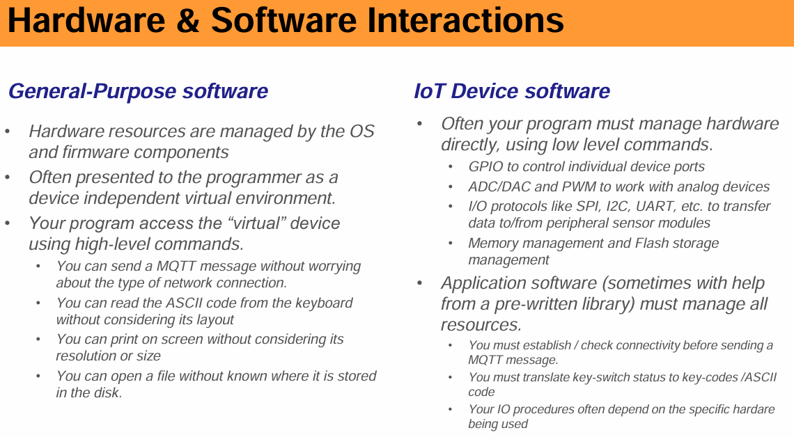

------

### **1. General-Purpose Software (PCs)**

- Hardware is **abstracted** by the **Operating System (OS)** and **firmware**.
- Provides a **virtual environment** for programmers, making hardware details invisible.
- Programs interact with "virtual" devices using high-level commands:
  - Sending an **MQTT message** without worrying about the network type.
  - Reading ASCII input from the keyboard **without knowing the keyboard layout**.
  - Printing text **without handling screen resolution**.
  - Opening files **without knowing their exact location on the disk**.

> #### 🔹 **Key Benefit**: Developers don’t need to worry about hardware details—everything is managed by the OS.

------

### **2. IoT Device Software**

- The program must manage **hardware directly**, using **low-level commands** such as:
  - **GPIO (General-Purpose Input/Output):** To control specific device ports.
  - **ADC (Analog-to-Digital Converter) / DAC (Digital-to-Analog Converter):** For analog signal processing.
  - **PWM (Pulse Width Modulation):** Used to control motors, LEDs, etc.
  - **I/O Protocols (SPI, I2C, UART):** Used for **sensor communication**.
  - **Memory and Flash Management:** No virtual memory—programmers must manage storage efficiently.
- **Application software must manually handle resources**: ==sometimes with the help from a pre-written library==
  - **MQTT communication**: You need to **manually check connectivity** before sending messages.
  - **Keyboard input processing**: Raw key-switch data must be **translated into ASCII codes**.
  - **I/O operations depend on the hardware**: Unlike PCs, where printing text is abstracted, IoT devices require **specific configurations**.

> #### 🔹 **Key Challenge**: IoT developers must directly interact with hardware, requiring more **low-level                ** programming and **manual resource management**.

### 3. Key differences 

| Feature                    | General-Purpose Software (PCs)         | IoT Device Software                         |
| -------------------------- | -------------------------------------- | ------------------------------------------- |
| **Hardware Abstraction**   | OS manages hardware                    | Programmer manages hardware                 |
| **Programming Complexity** | High-level APIs simplify development   | Requires direct hardware control            |
| **Device Communication**   | Automatically handled                  | Needs manual configuration (SPI, I2C, UART) |
| **Memory Management**      | Virtual memory and OS-level management | Manual memory and flash storage management  |
| **Ease of Use**            | Easier for developers                  | Requires embedded programming knowledge     |

- **PC software is user-friendly** because the OS abstracts hardware complexities.
- **IoT software requires low-level programming** because the developer must manually control hardware.
- If you're working with IoT, you’ll often **write C or Python** for microcontrollers (ESP32, STM32, Raspberry Pi, etc.) and use **protocols like MQTT, I2C, and SPI**.


------

## Cross platform development

IOT can't be developed in a single platform

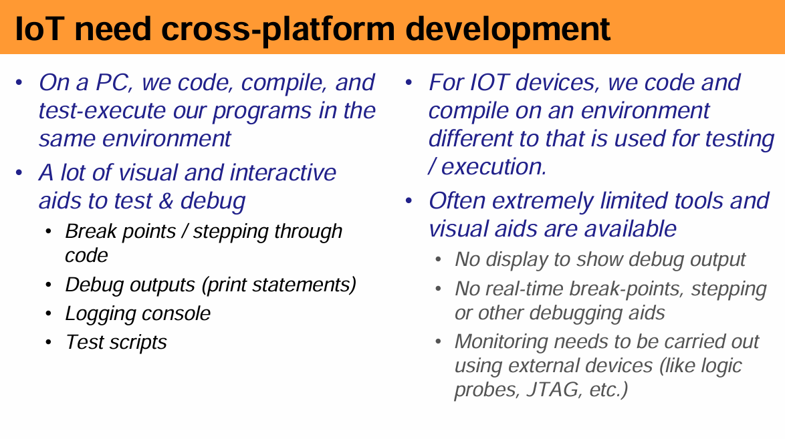

#### **1. Development on a PC (Traditional Software Development)**

- Everything happens in **one environment** (coding, compiling, testing, and execution).

- Advanced debugging tools

   available:

  - **Breakpoints & stepping through code**: Allows developers to pause execution and inspect variables.
  - **Debug outputs (print statements)**: Easy to track program flow.
  - **Logging console**: Collects real-time logs for troubleshooting.
  - **Test scripts**: Automate testing.

✅ **Why it’s easy?**
 Because the **development environment and execution environment are the same**.

------

#### **2. Development on IoT Devices (Embedded Systems)**

- Development & execution occur in different environments :
  - Code is written & compiled on a PC (cross-compilation).
  - The compiled binary is deployed to the **IoT device** (like an ESP32, Raspberry Pi, or STM32).

**Challenges in IoT Development**

1. **Limited debugging tools**:
   - **No display** for direct debug output.
   - **No breakpoints or real-time stepping** (like in PC-based debugging).
   - Debugging often requires **external hardware tools** (e.g., JTAG, logic probes).
2. **Monitoring difficulties**:
   - Unlike a PC, where errors and logs appear in a console, IoT devices might require **serial debugging (UART/USB)** or logging to external files.
   - Some IoT devices have **real-time constraints**, making debugging harder.
3. **Hardware-dependent debugging**:
   - Debugging might need **oscilloscopes, logic analyzers, or JTAG programmers**.
   - Debugging in low-power or networked IoT systems often requires **remote logging mechanisms**.

> <u>**How to Debug IoT Devices Efficiently?</u>**
>
> Here are **some workarounds** to make debugging easier in IoT projects:
>
> **1. Serial Debugging (UART)**
>
> - Most microcontrollers (ESP32, Arduino, STM32, etc.) support **UART-based debugging**.
>
> - Example for ESP32 using Serial Monitor:
>
>   ```cpp
>   void setup() {
>       Serial.begin(115200);  // Start serial communication
>       Serial.println("Device Started!");
>   }
>   
>   void loop() {
>       Serial.println("Reading sensor data...");
>       delay(1000);
>   }
>   ```
>
> - Output appears on the **serial monitor** in the Arduino IDE or PuTTY.
>
> **2. Remote Logging**
>
> - Instead of using a display, log data to a file or send it over **Wi-Fi, MQTT, or HTTP**.
>
> **3. JTAG Debugging**
>
> - JTAG (Joint Test Action Group) allows **hardware debugging** (used in ARM Cortex-based chips like STM32).
> - Requires an **external debugger** like the **Segger J-Link**.
> - Some has inbuilt JTAG.
> - unnecessary 
>
> **4. Use Emulators/Simulators**
>
> - Some IoT devices have emulators, such as:
>   - **QEMU** (for ARM Cortex IoT devices).
>   - **ESP-IDF simulator** (for ESP32).
>   - **Arduino Serial Plotter** (for sensor data visualization).
>     

------

**Key Takeaways**

| Feature                  | PC Development                      | IoT Development                               |
| ------------------------ | ----------------------------------- | --------------------------------------------- |
| **Coding & Compilation** | Same machine                        | Cross-compilation (PC → IoT)                  |
| **Debugging Tools**      | Breakpoints, stepping, console logs | Limited (requires UART, JTAG, external tools) |
| **Execution Monitoring** | Display output, logging             | Often headless (no direct display)            |
| **Ease of Debugging**    | Easy with IDE tools                 | Harder, requires external probes              |

------


## Features of IOT programming languages

1. **Lightweight and Efficient**

- IoT devices have limited processing power and memory, so programming languages must be optimized for small footprints.
- The code should be simple, fast, and consume minimal system resources to ensure smooth performance on embedded systems.

2. **Embeddable**

- IoT programming languages should integrate well with other environments, such as firmware or real-time operating systems.
- They should allow low-level hardware access for controlling sensors, actuators, and communication modules.

3. **Event-Driven Focus**

- IoT systems often rely on asynchronous event handling, where the system responds to external triggers like sensor inputs, network signals, or user commands.
- Features like timers, callbacks, and interrupt handling make the system responsive and efficient.

4. **Extensible**

- Modular programming allows flexibility in adding new features or integrating with third-party libraries.
- It supports different applications, from executing machine code on microcontrollers to running configuration scripts on cloud-connected devices.

5. **High-Level Abstractions**

- A good IoT language provides a simple and maintainable syntax while supporting multiple programming paradigms:
  - **Procedural** (structured step-by-step execution)
  - **Functional** (stateless, reusable functions)
  - **Data-flow** (event-based or stream processing)
  - **Object-oriented** (modular and reusable components)
- These abstractions improve code readability and scalability, making development easier.

------


## IoT - Popular runtimes and programming languages

A **programming language** defines how code is written, while a **runtime** is the environment that executes the code. The runtime provides the necessary system resources, libraries, and execution support.
 For example, MicroPython (runtime) allows Python (language) to run on microcontrollers, and Java (language) requires a Java Virtual Machine (runtime) to execute its bytecode.

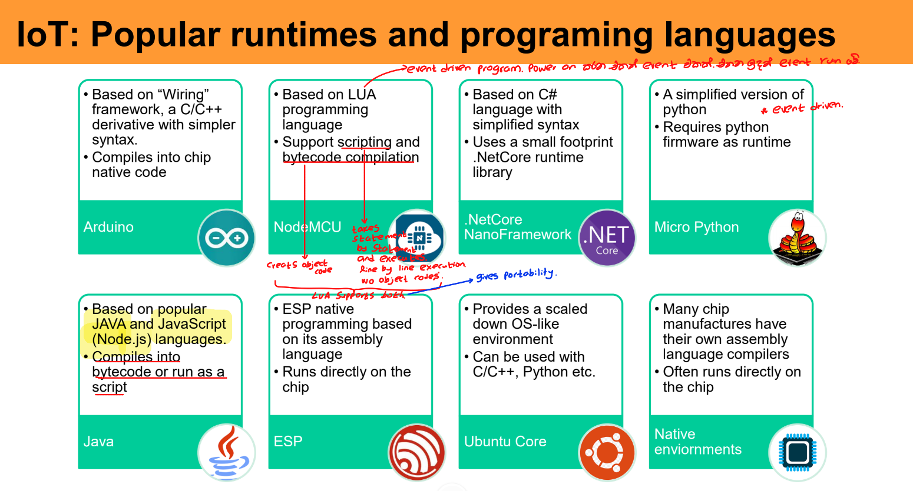

| **Runtime**               | **Programming Language**          |
| :------------------------ | :-------------------------------- |
| **Arduino**               | C/C++ (Wiring framework)          |
| **NodeMCU**               | LUA                               |
| **NetCore NanoFramework** | C#                                |
| **MicroPython**           | Python                            |
| **Java**                  | Java, JavaScript (Node.js)        |
| **ESP**                   | Assembly Language                 |
| **Ubuntu Core**           | C/C++, Python                     |
| **Native Environments**   | Assembly Language (Chip-specific) |

------

## IoT - Software Development environment


1. **Integrated Development Environment (IDE):**
   - Examples: VSCode, Arduino, Esplorer, Eclipse, STM32CubeIDE, Visual Studio.
   - Provides tools for writing, compiling, and debugging code.
2. **Application Software:**
   - Common programming languages used: (Programming language එක භාවිතා කර අපිට අවශ්‍ය දේවල් කරගන්න ලියපු code එක තමා application software කියන්නේ. ඒක වැඩ කරන්න අදාළ program එකේ runtime එක තිබිය යුතුයි. ex: code written with C + Arduino)
3. **Device Libraries:**
   - Software that comes from the manufacturer that is very specific to the device.
4. **Compilation and Execution Process:**
   - Code is compiled, assembled, and linked on the **development computer**.
   - A **runtime framework** is used to manage execution.
5. **Program Deployment:**
   - Downloaded onto the microcontroller via **USB** or **Over-the-Air (OTA)** updates.
     - **USB (Universal Serial Bus):** A physical wired connection used to transfer data or power between the computer and microcontroller. Commonly used for flashing firmware and serial communication.
     - **OTA (Over-the-Air) Updates:** A wireless method of uploading new firmware or software to the microcontroller without needing a physical connection. Often used in IoT devices for remote updates.
6. **Microcontroller and Sensors/Actuators:**
   - The compiled code is executed on the microcontroller, interfacing with sensors and actuators.
7. **Debugging:**
   - **JTAG Debugger** is used for hardware debugging and testing.

------

## IoT software development : Key concerns

1. **Writing Low-Level Code (C, C++)**
   - Keep the code simple and as short as possible.
   - Avoid complex and time-consuming tasks.
2. **Memory Constraints (RAM, ROM)**
   - Avoid using long arrays and large data structures.
   - Use appropriate data types to optimize memory usage.
3. **Real-Time Requirements and Scheduling**
   - Decide between RTOS (Real-Time Operating System) and bare-metal development.
     
   - 
   - Manage tasks and synchronization efficiently if RTOS is not used.
     
4. **Power Consumption Management**
   - Utilize sleep modes, wakeup timers, and low-power modes.
   - Consider processor and peripheral capability differences across power modes.
   - Optimize algorithms to reduce high-power mode usage.
5. **Interrupt Handling and Low-Latency Response**
   - Ensure efficiency in handling interrupts.
   - Critical for time-sensitive tasks in IoT applications.

------

## Key Components of an IoT Software

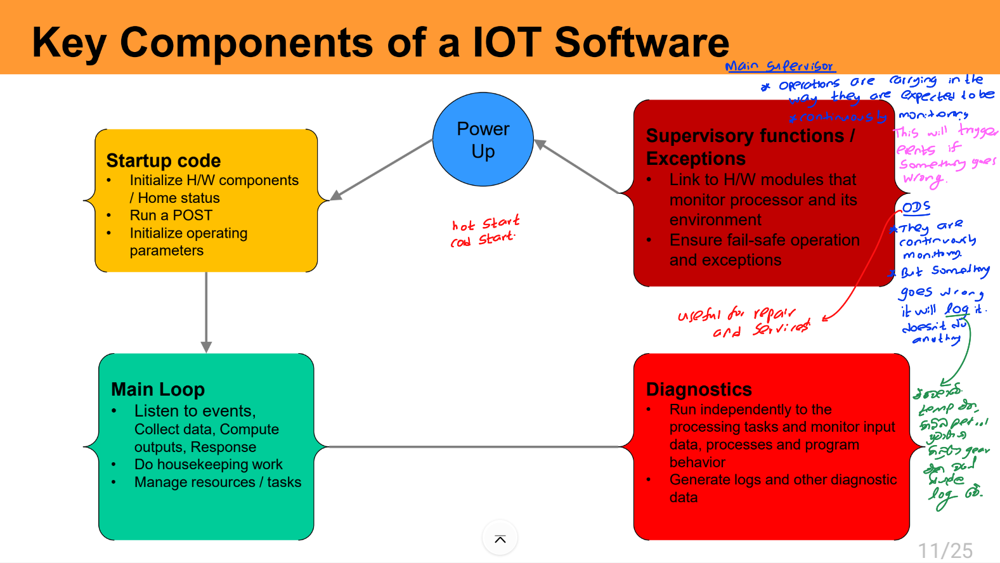

ODS (Operational Data Store)

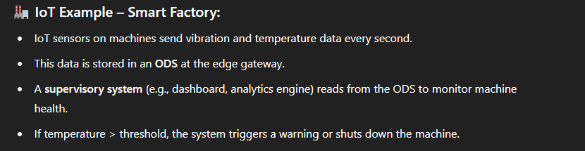

------

## Main Loop

> #### Supports Async & non blocking behavior

- IoT applications often require **low-latency responses** to external events. This demands asynchronous, non-blocking design patterns to avoid delays and maintain efficiency.

  

#### 1. **Interrupt Callbacks**

- The **runtime framework** monitors the environment (e.g., GPIO pins, sensor triggers).
- When an event occurs, it **automatically calls a specific function** in your code.
- 🟡 **Important:** Your callback function should execute **quickly**, avoiding long operations that may block other interrupts.
- 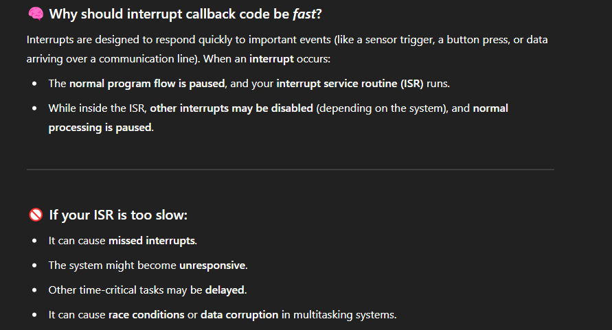

#### 2. **Timer Interrupts**

- The **runtime framework** triggers a callback function at **regular intervals** using a **hardware timer**.
- You can use this to **poll sensors or inputs** periodically.
- Useful when events happen at known or fixed time intervals.

#### 3. **Timer Functions (Non-blocking Timers)**

- The **runtime** maintains a **software-based non-blocking timer**.
- Your main loop must check if the timer has elapsed (e.g., using `millis()` or similar).
- Helps perform actions **periodically** without blocking the main loop.

#### 4. **Native Management**

- No built-in support from the runtime for async behavior.
- You must **manually monitor** inputs, timers, or other asynchronous sources.
- All logic for event detection and response is implemented in your main loop.

> [!TIP]
>
> <u>Analogy using a robot</u>
>
> 🧠 Imagine this:
>
> You have a **robot friend**. It can see, hear, and do things — but it only does stuff **when something happens**. There are **4 ways** to tell it **how to know something happened**.
>
> ------
>
> 1. **Interrupt Callback – "Tap on the Shoulder"**
>
> Imagine your robot is playing a game, and someone taps it on the shoulder to say, “Hey! Look, a button was pressed!”
>
> - 💬 The robot **quickly turns**, looks, and says "Okay!"
> - Then it **gets back to the game immediately**.
> - ⏱️ It must **look quickly** so it doesn’t miss other important things!
>
> 👉 This is like a **quick helper function** that runs when something happens (like pressing a button or a sensor detecting motion).
>
> ------
>
> 2. **Timer Interrupt – "Set an Alarm Clock"**
>
> You tell your robot,
>  🕐 "Every 10 seconds, check the temperature."
>
> - So the robot keeps doing its thing, and every 10 seconds it **stops for a second** to check the temperature.
> - Then it continues with whatever it was doing.
>
> 👉 This is like having a **built-in alarm** that tells your robot to **do something every once in a while**.
>
> ------
>
> 3. **Timer Function – "Check the Clock Yourself"**
>
> Now you say:
>  “Hey robot, look at the clock, and **if it’s been 10 seconds**, go check the temperature.”
>
> - The robot looks at the clock again and again, while doing other stuff.
> - When the time is right, it checks the temperature.
>
> 👉 Here, **you’re not using an alarm** — your robot just **keeps checking the time** to decide when to do something.
>
> ------
>
> 4. **Native Management – "Always Be Watching"**
>
> This time, you say:
>  “Just keep watching the sensors and decide what to do all by yourself.”
>
> - The robot is **constantly looking around**, checking if something changed.
> - It needs to do everything on its own — **no help from alarms or taps**.
>
> 👉 This means **you write all the code** to constantly watch what's going on — it’s all up to **your program**.

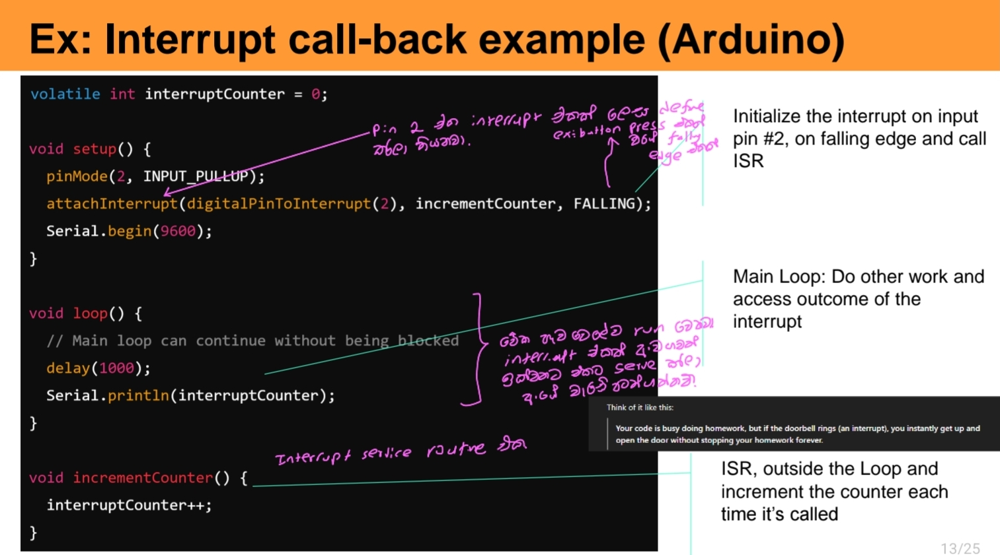

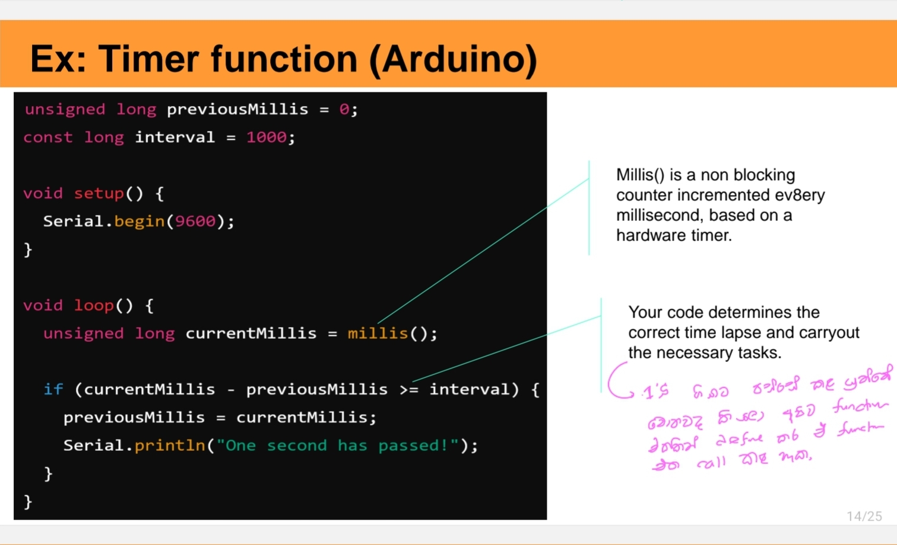


------

## Security considerations in IOT

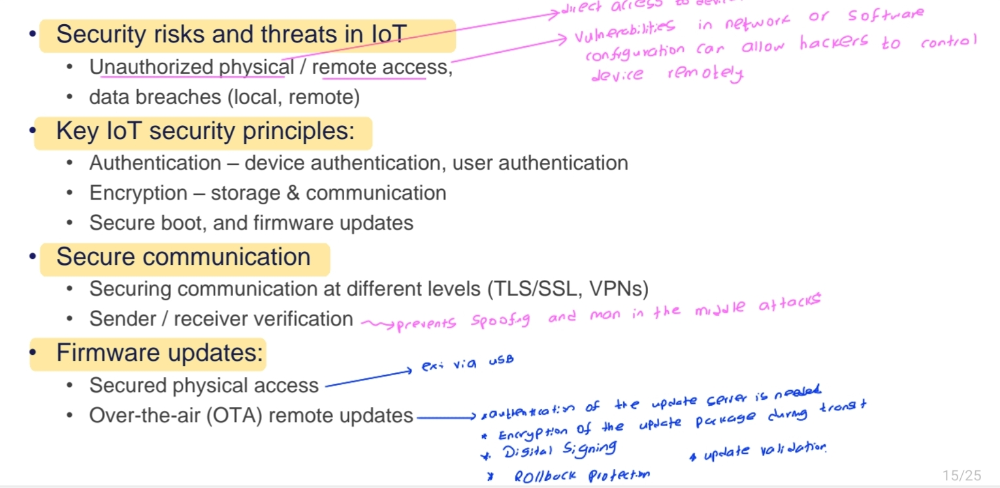.


## Testing and debugging in IOT

> [!NOTE]
>
> Here's a clean and organized summary of **Testing and Debugging in IoT Systems**, broken down into **Challenges**, **Techniques**, and **Tools**. Perfect for inclusion in a report, documentation, or presentation slide deck:
>
> ------
>
> ## 🧪 **Testing and Debugging in IoT Systems**
>
> ### 🔧 **Challenges**
>
> 1. **Limited Visibility into Hardware**
>    - IoT devices often lack sophisticated debugging interfaces (Like in PC-based systems), making it hard to detect low-level issues.
> 2. **Intermittent Behavior**
>    - Devices may act unpredictably due to **power fluctuations**, **environmental conditions**, or **network disruptions**, complicating root cause analysis.
> 3. **Hardware Dependencies**
>    - Testing may require **specialized sensors or devices** that are not readily available, increasing difficulty and cost.
> 4. **Real-Time Constraints**
>    - **Timing-sensitive behavior** can be hard to reproduce and diagnose outside of the target deployment environment.
> 5. **Asynchronous Operations**
>    - Bugs triggered by async events (like delayed sensor responses or network packets) may be rare and hard to catch without proper instrumentation.
>
> ------
>
> ### 🧩 **Techniques**
>
> 1. **Unit Testing for Embedded Systems**
>    - Isolate and test specific components (e.g., sensor drivers, protocol stacks) before full integration.
> 2. **Hardware-in-the-Loop (HIL) Testing**
>    - Simulate hardware inputs to test the software in a controlled but realistic environment.
> 3. **Software Simulators / Emulators**
>    - Mimic sensor or actuator behavior to test logic without requiring physical hardware.
> 4. **Static Functional Testing**
>    - Analyze how software behaves without considering timing—ideal for early validation of logic and flow.
> 5. **Real-Time Trace Debugging**
>    - Collect and analyze logs/events in real time using tools like **FreeRTOS Trace**, **Segger SysView**, or onboard console logs to understand what’s happening internally.
>
> ------
>
> ### 🛠️ Tools
>
> 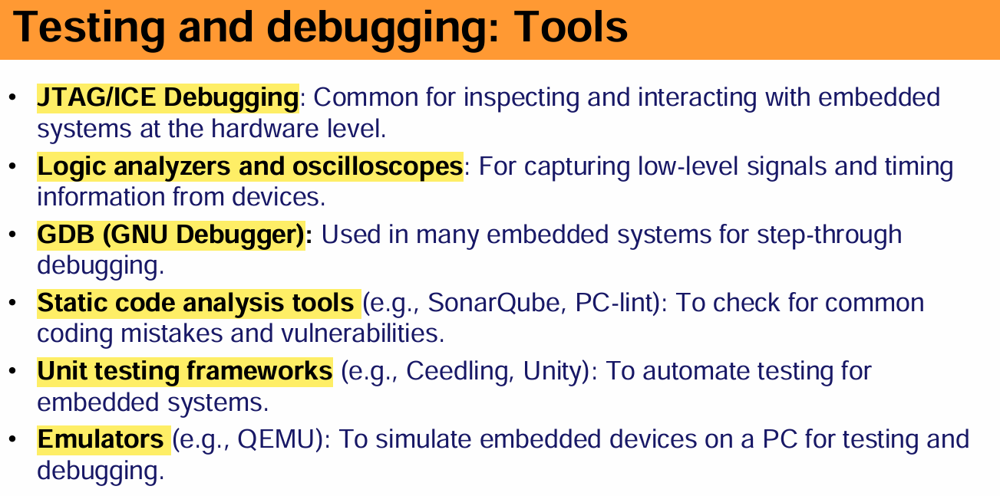
>
> 

## Power management in IoT devices

> [!NOTE]
>
> # 🔋 **Power Management in IoT Devices**
>
> ------
>
> ### ⚠️ **Why Power Management Matters**
>
> - Many IoT devices are **battery-powered** (e.g., wearables, remote sensors).
> - Power consumption directly affects:
>   - 📆 **Device lifespan**
>   - 💰 **Maintenance costs**
>   - ⚖️ **Portability and size (due to battery size)**
>   - Power hungry devices  require larger batteries, reducing portability and increasing cost
> - Long-term deployments (e.g., agricultural, industrial sensors) require **multi-year operation** without battery changes.
>
> <u>⚙️ **Key Considerations**</u>
>
> - **Active vs. Standby Power**:
>   - Keep radios (WiFi/BLE) **off or in standby** until needed for transmission.
> - **Operational Protocols**:
>   - Use **Bluetooth Low Energy (BLE)** over conventional Bluetooth for dynamic, on-demand communication.
>
> ------
>
> ## <u>🧠 **Power Management Strategies**</u>
>
> #### 🛌 **Sleep Modes (Low-Power States)**
>
> - **Idle / Sleep / Deep Sleep / Hibernate** modes provided by MCUs.
> - Trade-off: **Lower power mode** ⟷ **Longer wake-up latency** .Deep sleep reduces power consumption but introduces latency when waking up.
> - Example: Wake only when sensor threshold is crossed or data needs transmission.
>
> ------
>
> #### ⚡ **Dynamic Voltage and Frequency Scaling (DVFS)**
>
> - Adjust processor voltage and frequency based on workload.
> - Reduces power use during idle periods.
> - Requires **smart workload monitoring** to balance performance and efficiency.
>
> ------
>
> #### 🔔 **Event-Driven & Interrupt-Based Power Management**
>
> - Devices remain in sleep until an **event or interrupt** triggers them.
> - Examples:
>   - Button press
>   - Sensor threshold breach
>   - Timer-based wake-up
>
> ------
>
> #### 📡 **Energy-Efficient Communication**
>
> - Use **low-power communication protocols**:
>   - BLE, Zigbee, LoRa, NB-IoT
> - Reduce transmission frequency:
>   - **Batch data** and transmit periodically (e.g., every 10 min vs. every second)
> - Use **adaptive transmission power** in weak signal areas.
>
> ------
>
> #### 📅 **Power-Aware Scheduling**
>
> - Schedule **high-energy tasks** during periods of low power draw.
> - 
> - Postpone non-critical tasks if battery is low.
> - Prioritize tasks based on **energy requirement**.
>
> ------
>
> ## <u>💻 **Power Considerations in Software Design**</u>
>
> #### 🧠 **Efficient Code Design**
>
> - Optimize algorithms to reduce CPU cycles.
> - Use **bitwise operations** and efficient logic for faster execution.
> - Minimize **loop iterations** and avoid unnecessary polling.
>
> #### 🌐 **Network Efficiency**
>
> - Use protocols and stacks optimized for low power.
> - Apply **data compression** to reduce transmission size and duration.
> - Batch transmissions where possible.
> - 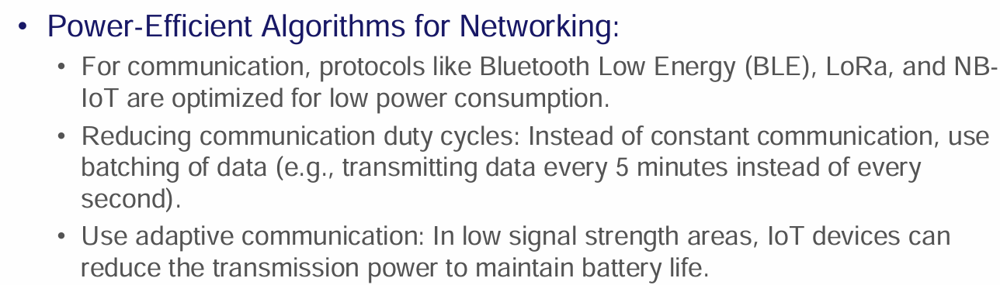
>
> #### 🧩 **Peripheral Management**
>
> - Power down unused peripherals (LEDs, displays, etc.).
> - Use **low-power sensors** (e.g., ultra-low-power accelerometers).
> - Rely on **interrupts** instead of polling to wake up the MCU.
>
> #### 🔄 **Low-Power Sensor Sampling**
>
> - Use **periodic** rather than continuous sampling.
> - Sensors with built-in sleep modes or low-power modes are preferred.
> - Example: Motion sensors that only wake MCU when movement is detected.
>
> 

## Deployment and maintanance

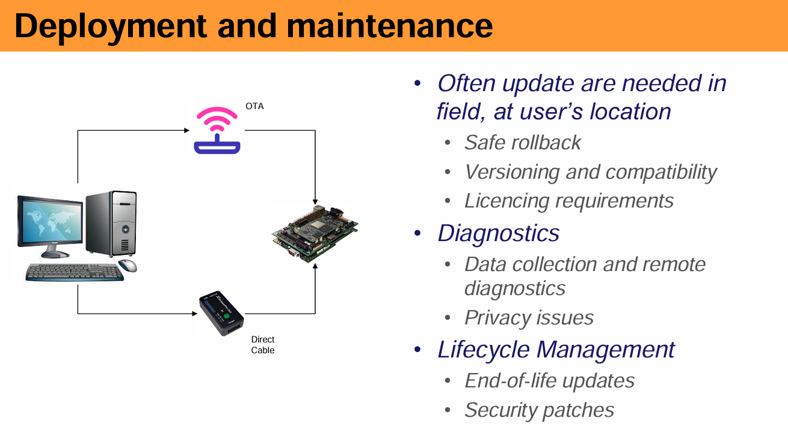