# 		Sensors and Actuators

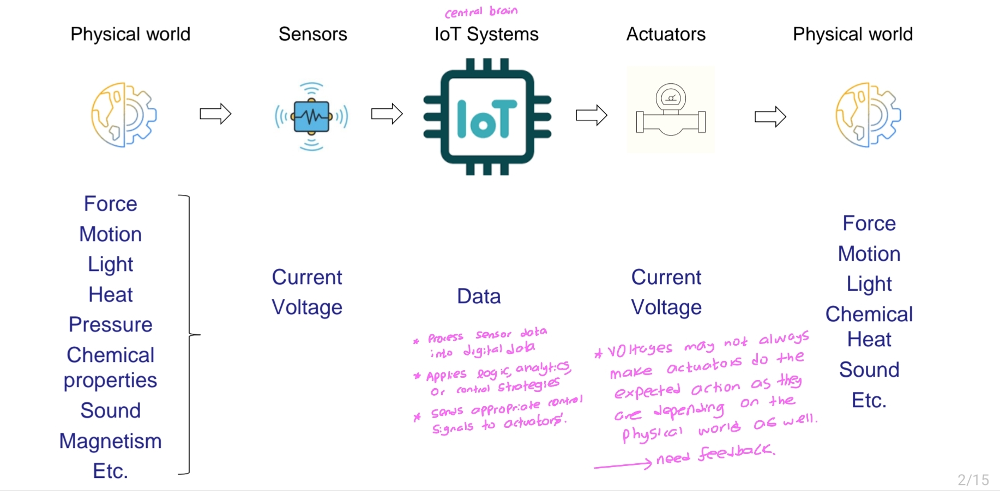

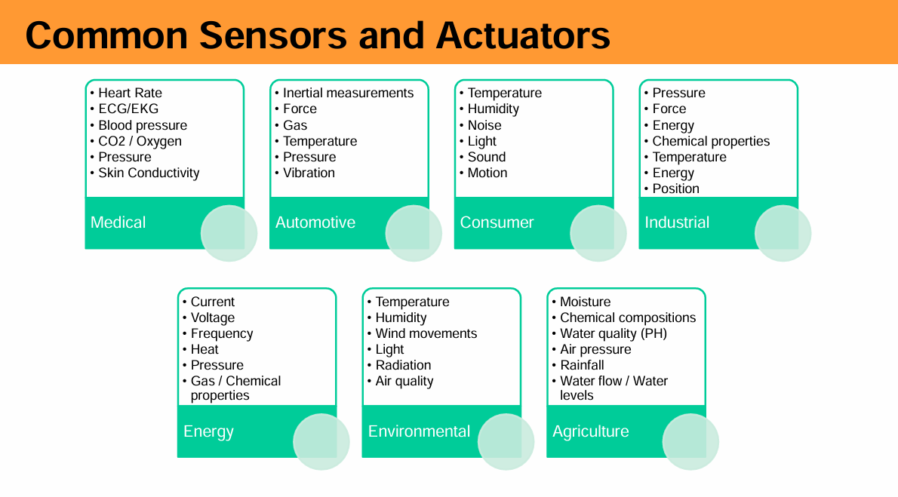

## 🧭 **Classification of Sensors**

Sensors can be classified based on **power requirement**, **data behavior**, **measurement principle**, and **reference mode**:

> [!NOTE]
>
> ### ⚡ **1. Active vs. Passive Sensors**
>
> | Type        | Description                                                  | Example                  |
> | ----------- | ------------------------------------------------------------ | ------------------------ |
> | **Active**  | Require an external power source to operate and measure signals. | LIDAR, Radar, Ultrasonic |
> | **Passive** | Operate without external power, generating output based on sensed energy. | Thermocouple, Photodiode |
>
> 
>
> ### 🔄 **2. Continuous vs. Discrete Sensors**
>
> | Type           | Description                                                  | Example                                        |
> | -------------- | ------------------------------------------------------------ | ---------------------------------------------- |
> | **Continuous** | Provide real-time, uninterrupted analog output in sync with physical change. | Temperature sensors (analog)                   |
> | **Discrete**   | Output values at fixed sampling intervals or digital form.   | Digital temperature sensor, Proximity switches |
>
> 
>
> ### 🧪 **3. Primary vs. Secondary Sensors**
>
> | Type          | Description                                                  | Example                                      |
> | ------------- | ------------------------------------------------------------ | -------------------------------------------- |
> | **Primary**   | Directly convert physical quantity into electrical signal.   | Thermocouple (heat → voltage)                |
> | **Secondary** | Convert physical quantity into an intermediate form, then into electrical. | Strain gauge (force → deformation → voltage) |
>
> 
>
> ### 📏 **4. Absolute vs. Relative Sensors**
>
> | Type         | Description                                                  | Example                                 |
> | ------------ | ------------------------------------------------------------ | --------------------------------------- |
> | **Absolute** | Output directly represents the measured value relative to a fixed standard. | Absolute pressure sensor                |
> | **Relative** | Measure change compared to a reference point or baseline.    | Gauge pressure sensor, IR motion sensor |

------

#### examples

##### 1. <u>LDR</u> 

- Light dependent Resistor.
- LDR is also temperature dependent.

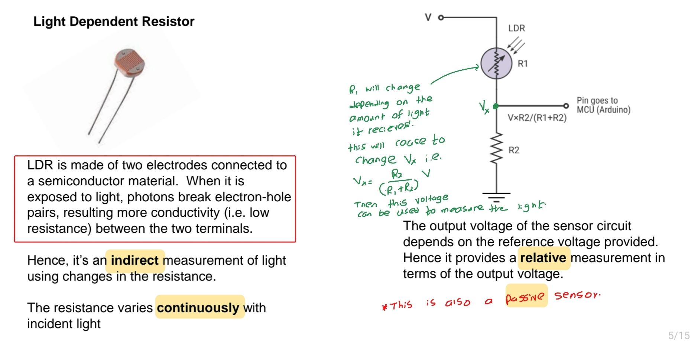

| Classification Type        | LDR Classification      | Explanation                                                  |
| -------------------------- | ----------------------- | ------------------------------------------------------------ |
| **Active vs Passive**      | ✅ **Passive Sensor**    | It does **not require an external power source** to generate the sensing effect. |
| **Continuous vs Discrete** | ✅ **Continuous Sensor** | The **resistance changes continuously** with varying light intensity. |
| **Primary vs Secondary**   | ✅ **Secondary Sensor**  | Light is first converted to a change in **resistance**, which is then used in a circuit to measure voltage. |
| **Absolute vs Relative**   | ✅ **Relative Sensor**   | The output **voltage depends on a reference voltage**; hence, the light level is **measured relative** to this reference. |

------

##### 2. <u>Capacitive Moisture sensor</u>

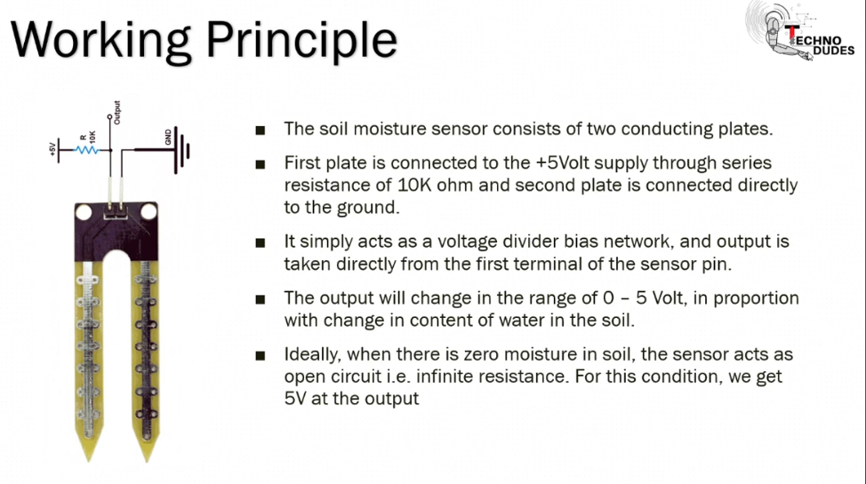

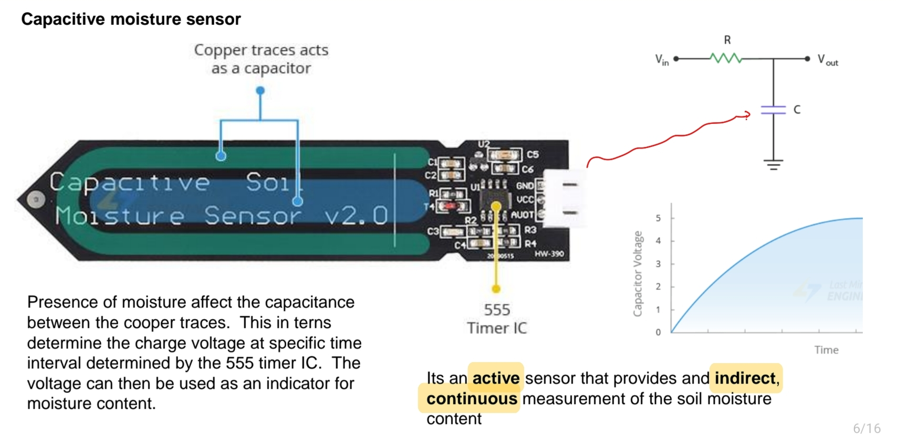

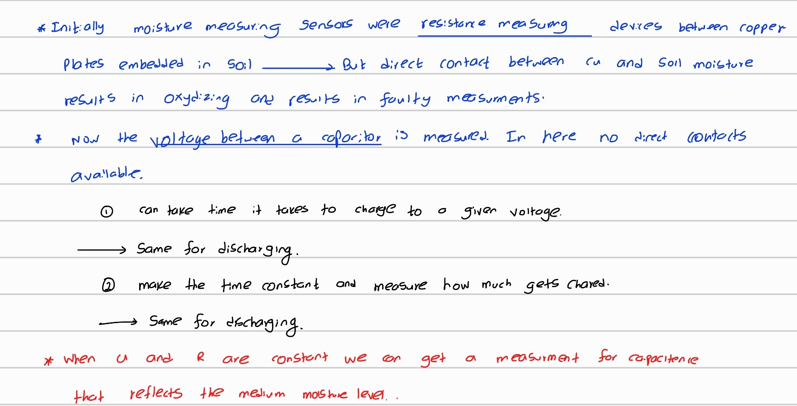

🔧 **Working Principle**

- The sensor is made of **two conductive copper traces** (plates) on a PCB, forming a **capacitor**.
- The **soil acts as the dielectric material** between the plates.
- As the **moisture level in the soil increases**, the **dielectric constant** of the soil changes (water has a higher dielectric constant than dry soil).
  - ➜ This leads to an **increase in capacitance**.

⚡ **Role of the 555 Timer Circuit**

> ⏱️ **What is the Purpose of the 555 Timer in a Capacitive Moisture Sensor Circuit?**
>
> The **555 timer** isn’t measuring moisture *directly*. Instead, it’s used as a **timing and signal generator tool** to help **convert capacitance into a voltage or frequency** — something a microcontroller can read and interpret.
>
> Here’s why it's useful:
>
> ------
>
> 🧩 **1. Capacitance Alone Is Hard to Measure**
>
> Capacitance changes with soil moisture, but:
>
> - Microcontrollers **cannot measure capacitance directly**.
> - They **can measure time, frequency, or voltage**.
>
> So we need a **circuit** to *convert changes in capacitance into changes in voltage or timing*. That’s where the **555 timer** comes in.
>
> ------
>
> ⚙️ **2. 555 Timer as a Frequency Generator (Astable Mode)**
>
> In **astable mode**, the 555 timer produces a **square wave signal**, and its **frequency depends on the capacitance**:
> $$
> f = \frac{1.44}{(R_1 + 2R_2)C}
> $$
>
> - **More moisture** → **higher capacitance (C)** → **lower frequency**
> - **Less moisture** → **lower capacitance** → **higher frequency**
>
> The microcontroller then measures **pulse width or frequency**, which indirectly tells you the moisture level.
>
> ------
>
> ⚡ **3. Alternative Use – Voltage Measurement**
>
> <mark>This method is used here</mark>
>
> In some designs, the 555 is used to **charge the capacitor**, and the voltage across it is measured at a **fixed time**.
>
> From this formula:
> $$
> V(t) = V_{\text{max}} \cdot \left(1 - e^{-t/RC}\right)
> $$
>
> - **Wet soil** → large $C$ → slower charging → **lower voltage at time $t$**
> - **Dry soil** → small $C$ → faster charging → **higher voltage at time $t$**
>
> The 555 timer provides **consistent timing behavior** needed to generate that predictable response.

1. A **555 Timer IC** is often used in **astable mode** to:
   - Charge and discharge the capacitor formed by the sensor at a **constant frequency**.
2. The **voltage across the capacitor** at a specific time point reflects the **amount of moisture**:
   - Wet soil → higher capacitance → slower charging → **lower voltage at fixed time**
   - Dry soil → lower capacitance → faster charging → **higher voltage at fixed time**

This voltage is then:

- **Read by a microcontroller** (e.g., Arduino ADC input).
- **Mapped to moisture levels** through calibration.

------

🔍 **Classification of the Capacitive Moisture Sensor**

| **Classification Type**    | **Sensor Classification** | **Explanation**                                              |
| -------------------------- | ------------------------- | ------------------------------------------------------------ |
| **Active vs Passive**      | ✅ **Active Sensor**       | Requires **external power** to operate the capacitor circuit and the 555 timer. |
| **Continuous vs Discrete** | ✅ **Continuous Sensor**   | Continuously varies voltage output **in real time** with changing moisture levels. |
| **Primary vs Secondary**   | ✅ **Secondary Sensor**    | Measures **moisture indirectly** by sensing its effect on **capacitance**. |
| **Absolute vs Relative**   | ✅ **Relative Sensor**     | Output voltage reflects moisture **relative to a reference** or a **calibration curve**. |

🧪 **Why It's Preferred Over Resistive Sensors**

- **No direct contact** with soil water → less corrosion.
- **More durable** for long-term deployment.
- **More accurate** in varying soil types (especially if calibrated).

------

####  <u>MEMS Sensors</u>

​                                                                  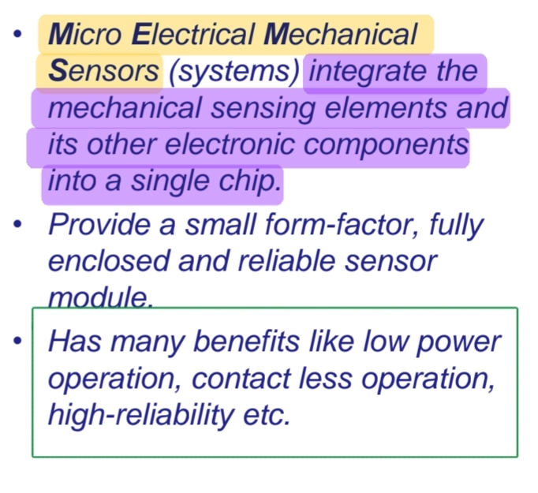 

🌟 Advantages of MEMS Sensors

- **Miniaturization**: MEMS sensors are compact, ideal for **portable and embedded systems**.

- **Low Power**: Optimized for **battery-powered** devices, ensuring long life.

- **Reliability**: With **no moving parts**, these sensors are **durable** and **resistant to wear**.

- **Cost-Effective**: Fabricated using **semiconductor processes**, which make them inexpensive to mass-produce.

- **High Sensitivity**: MEMS sensors are capable of detecting even small changes in pressure or force.

  Types of MEMS Sensors

- | **Category**             | **Type of MEMS Sensor**             | **Explanation**                                              |
  | ------------------------ | ----------------------------------- | ------------------------------------------------------------ |
  | **Mechanical Sensing**   | **Pressure Sensor**                 | Measures change in pressure; commonly used in industrial and medical applications. |
  | **Accelerometers**       | **Acceleration/Orientation Sensor** | Measures linear acceleration and tilting; used in automotive and mobile devices for motion detection. |
  | **Gyroscopes**           | **Rotational Sensor**               | Measures angular velocity and orientation; used in navigation and gaming applications. |
  | **Magnetometers**        | **Magnetic Field Sensor**           | Detects magnetic fields; used in compasses and electronic devices. |
  | **Force/Torque Sensors** | **Strain Gauge**                    | Measures deformation due to applied force; used in industrial machinery and robotics. |
  | **Temperature Sensors**  | **Thermometers**                    | Measures temperature changes; integrated in various applications like wearables and HVAC systems. |

##### <u>3. MEMS Pressure Sensor</u>

​                                                                       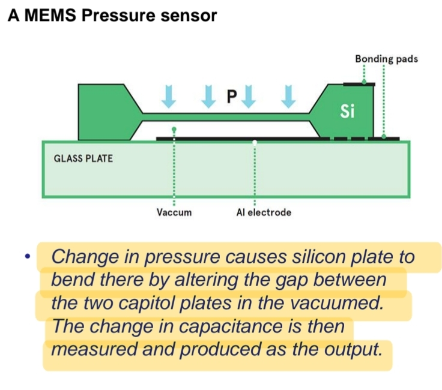 $C=ε⋅\frac Ad$ 

> [!important]
>
> ### So, in practice:
>
> - A **MEMS pressure sensor** could be a **combination** of several classifications. For example, it could be an **active, primary, absolute** pressure sensor or a **passive, secondary, relative** pressure sensor.
> - This flexibility allows **MEMS sensors** to be tailored for a wide variety of applications, such as automotive, industrial, medical, and consumer electronics.

##### 4. <u>MEMS Accelerometer</u>

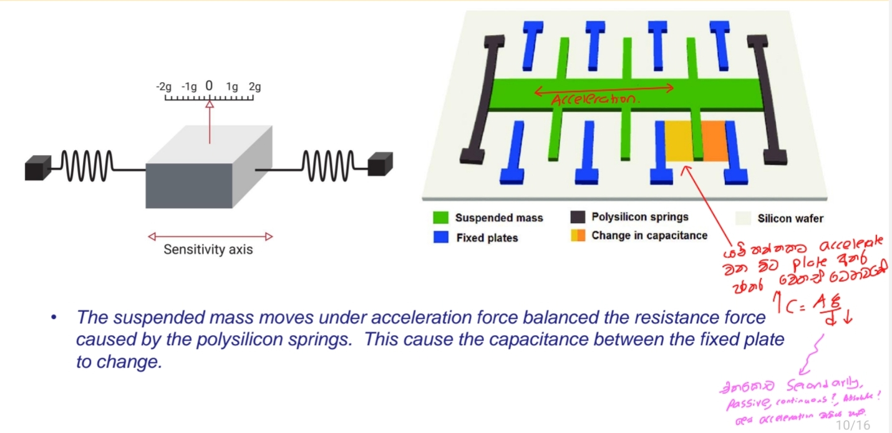

## From Sensors to Sensor Modules

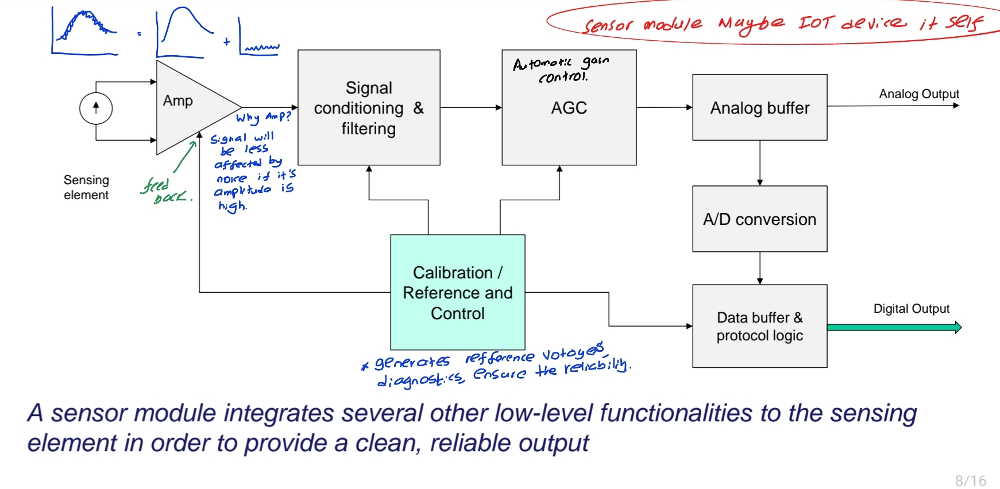

> [!TIP]
>
> This diagram explains how **raw sensor signals** are processed inside a **sensor module** to produce **clean, reliable analog or digital outputs**.
>
> ------
>
> ### 🔄 Flow: From Sensing Element to Final Output
>
> 1. **Sensing Element**
>    - The core sensor that directly detects a physical phenomenon (e.g., temperature, light, pressure).
>    - It produces a raw signal (usually a small current or voltage).
> 2. **Amp (Amplifier)**
>    - Boosts the weak signal from the sensor so it can be processed more effectively.
> 3. **Signal Conditioning & Filtering**
>    - Cleans up the amplified signal.
>    - Removes noise or unwanted frequencies.
>    - Ensures the signal is within an acceptable range and form.
> 4. **AGC (Automatic Gain Control)**
>    - Dynamically adjusts the signal strength so it remains consistent despite variations.
>    - Works together with calibration logic to maintain accuracy.
> 5. **Analog Buffer**
>    - Prepares the signal for either analog output or further digital processing.
>    - Provides an **Analog Output** at this stage if needed.
> 6. **A/D Conversion (Analog-to-Digital Conversion)**
>    - Converts the clean analog signal into digital form (binary numbers) for digital systems to understand.
> 7. **Data Buffer & Protocol Logic**
>    - Packages and formats the digital signal for communication.
>    - Implements standard communication protocols (like I2C, SPI, etc.).
>    - Outputs the **Digital Output**.
> 8. **Calibration / Reference and Control (Feedback Path)**
>    - Ensures the entire signal chain remains accurate and stable.
>    - Feeds back into the amplifier and filtering blocks to adjust performance dynamically.
>    - Handles temperature compensation, offset correction, etc.
>
> ------
>
> ### 🧠 Summary (Text at Bottom)
>
> > "A sensor module integrates several other low-level functionalities to the sensing element in order to provide a clean, reliable output."
>
> This means:
>
> - A sensor module is **more than just a sensor**.
> - It includes **amplification, filtering, auto-calibration, and digitization**.
> - This ensures the output is **accurate, consistent, and easy to use** by an IoT system or microcontroller.

------

## Sensor response: Ideal and Practical

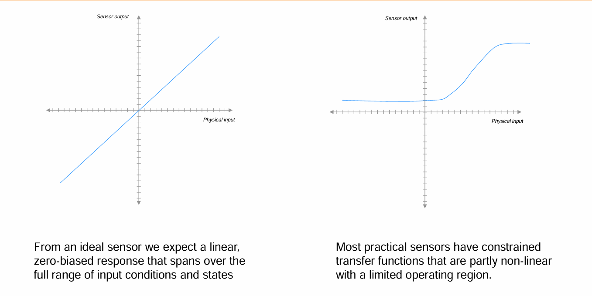

## Important Parameters

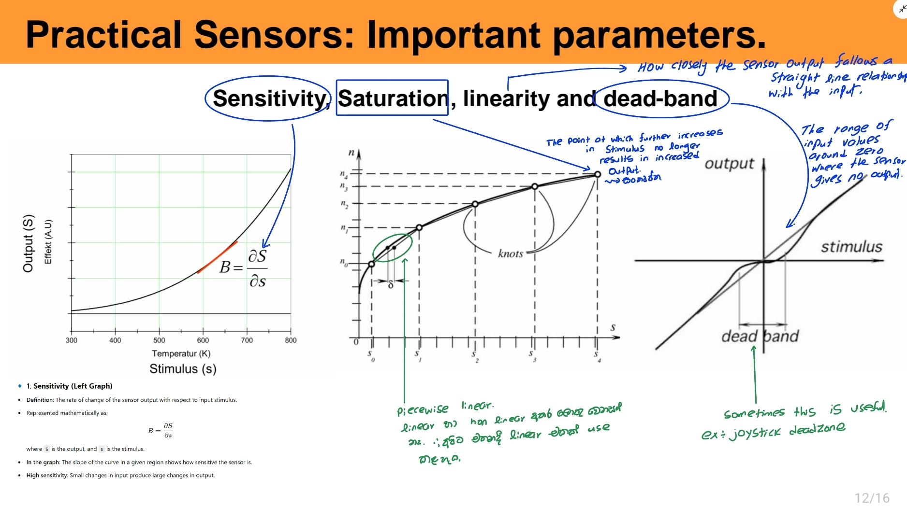

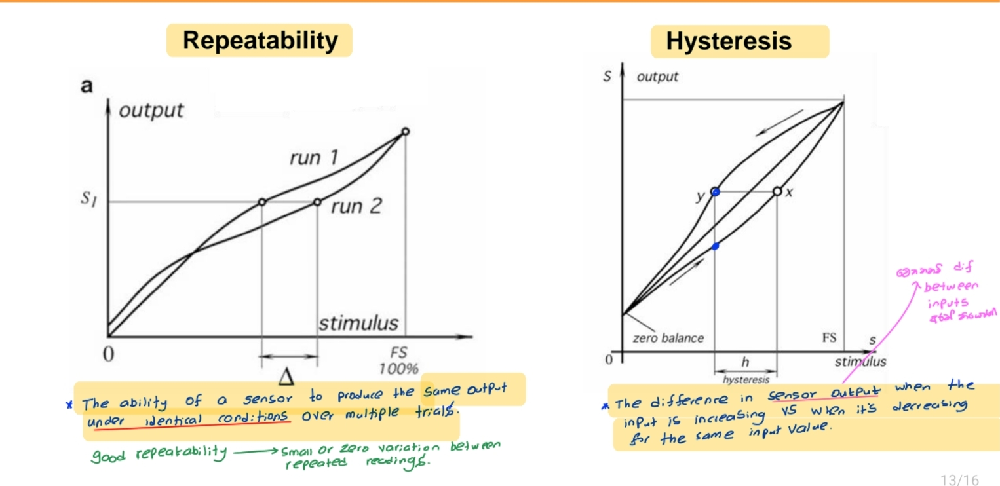

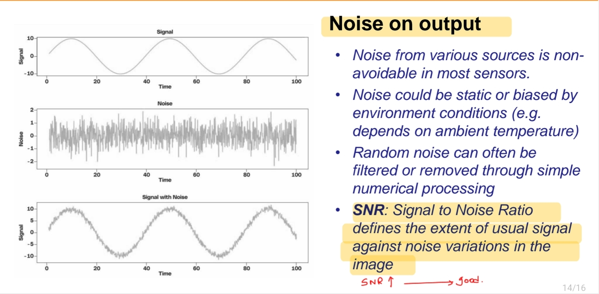

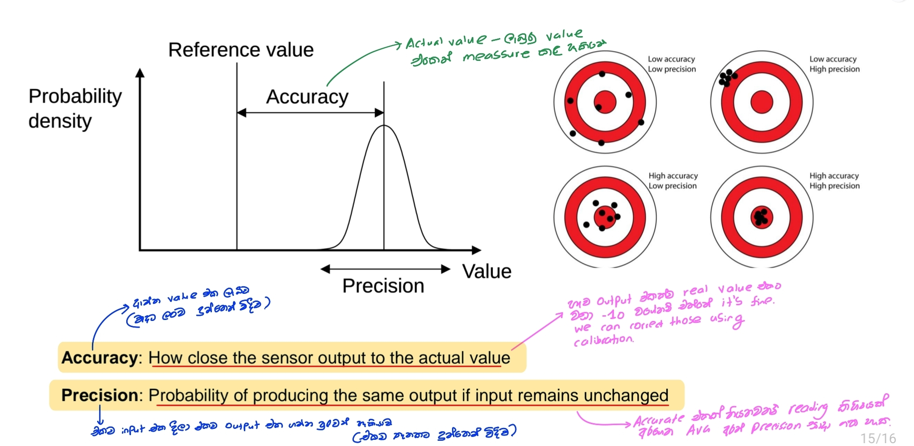

## Sensor Reliability

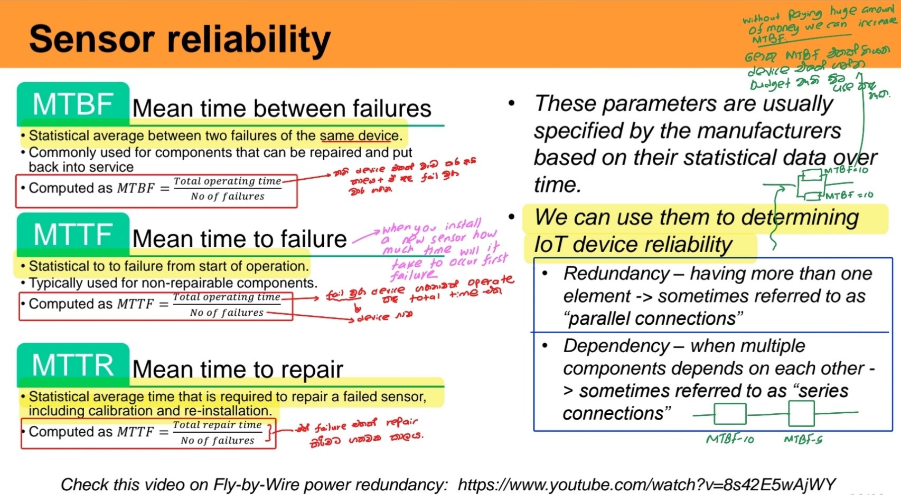