# 			Microcontroller internals

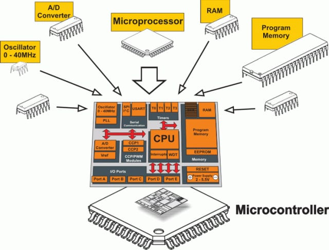

> [!TIP]
>
> # Data driven vs IO driven applications
>
> | Aspect                | Data Driven                                           | IO Driven (Event driven)                                     |
> | --------------------- | ----------------------------------------------------- | ------------------------------------------------------------ |
> | **Data Source**       | Data is preloaded into memory                         | Data comes from the external environment (e.g., sensors)     |
> | **Memory Usage**      | High memory usage; large, fast-access memory required | Limited memory usage; speed and size are not critical        |
> | **Instruction Set**   | Complex instructions for number crunching             | Simple but fast instructions                                 |
> | **Data Availability** | Synchronous: data is available when needed            | Asynchronous: data arrives when the environment changes      |
> | **Event Type**        | Mostly responds to internal changes                   | Must handle multiple external events, often requiring immediate attention |
> | **Processing Nature** | Ideal for stored-program serial processing            | Needs real-time response mechanisms                          |
> | **Suitability**       | Suitable for computation-heavy, analysis-driven tasks | Suitable for real-time, event-driven systems like embedded systems or reactive control systems |
>
> # Hardware and programmer's views
>
> 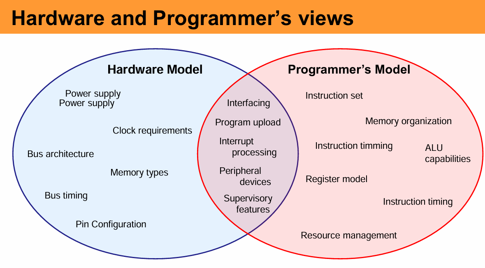

## 1. Components of a microprocessor

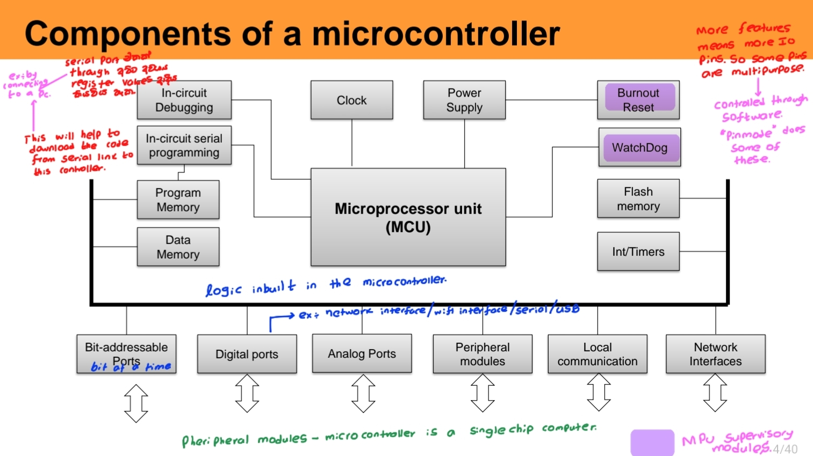

> [!TIP]
>
> 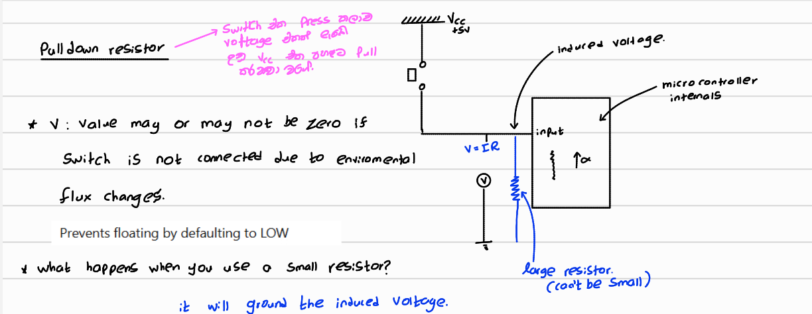
>
> 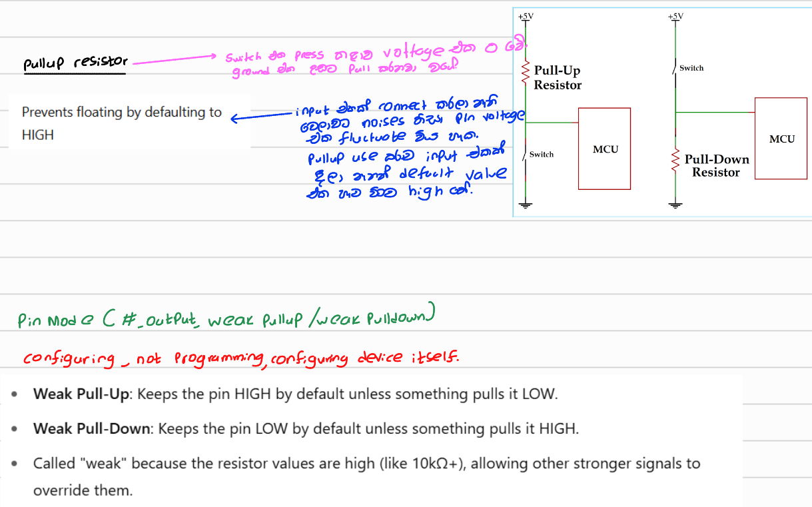
>
> 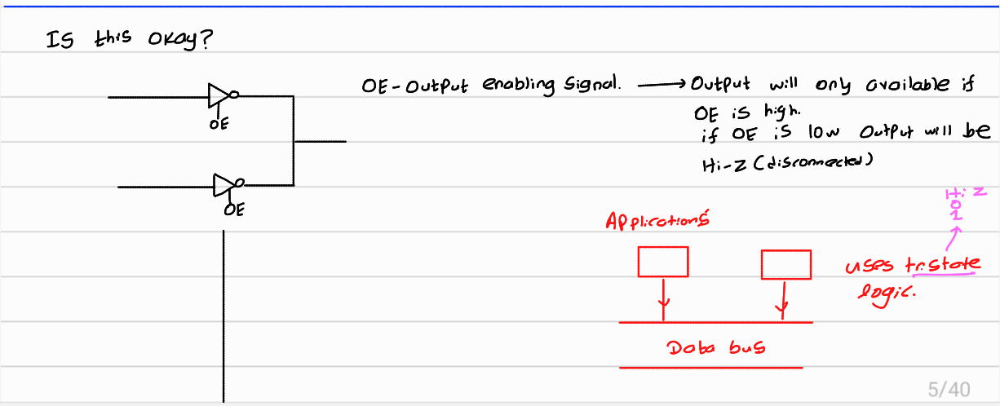
>
> 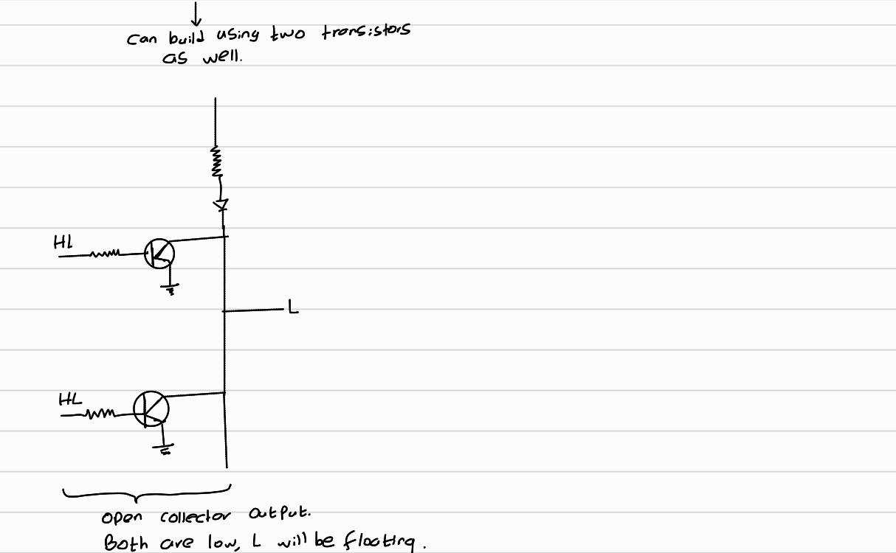

## 2. MPU in microcontroller

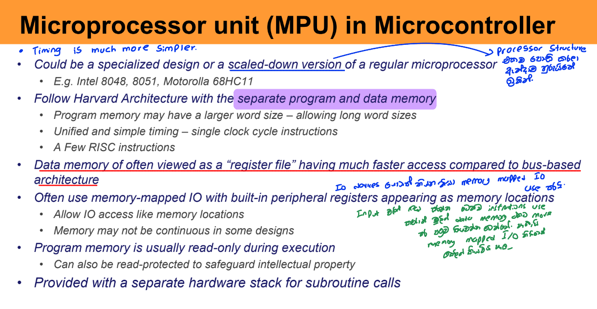

| Feature                      | Description                                                  |
| ---------------------------- | ------------------------------------------------------------ |
| **Design**                   | Specialized or scaled-down version of a full microprocessor  |
| **Examples**                 | Intel 8048, 8051; Motorola 68HC11                            |
| **Architecture**             | Harvard Architecture – separate program and data memory      |
| **Program Memory Word Size** | May be larger to support long instruction words              |
| **Instruction Timing**       | Unified, simple timing; often single clock cycle per instruction |
| **Instruction Set**          | Few RISC-like instructions; streamlined for efficiency       |
| **Data Memory**              | Treated as a fast-access "register file" instead of slower bus-based memory                   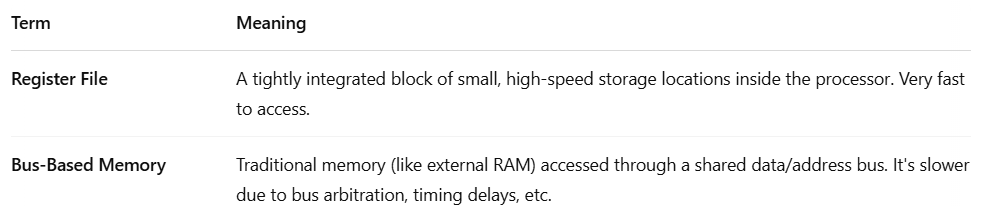 |
| **IO Handling**              | Uses **memory-mapped IO** – peripheral registers act like regular memory locations |
| **IO Access**                | IO can be accessed just like memory (load/store instructions) |
| **Memory Organization**      | Memory may be **non-continuous** in some microcontroller designs |
| **Program Memory Access**    | Typically **read-only during execution**; ensures code stability |
| **Security Features**        | Program memory can be **read-protected** to prevent code theft or reverse engineering |
| **Subroutine Support**       | Includes a **dedicated hardware stack** for handling function calls and returns |

## 3. Supervisory modules for MPU

- Completely separate hardware to a microprocessor. But a part of MCU

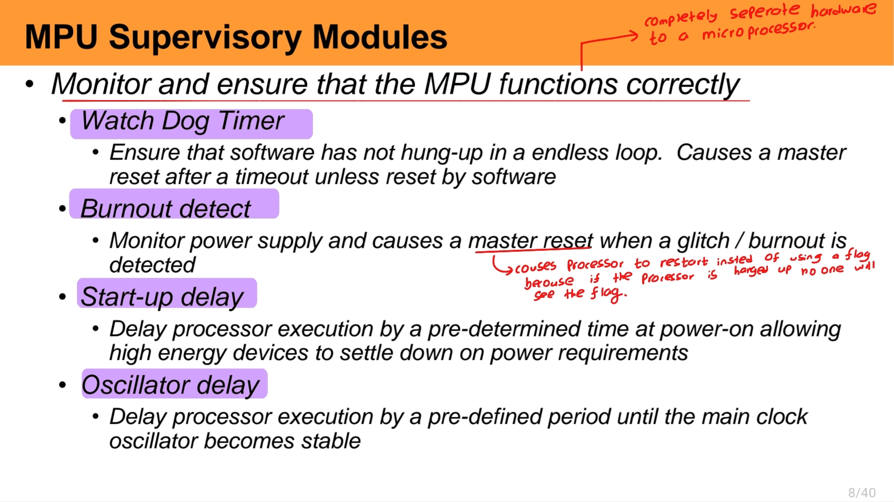

## 4. ICSP and ICD

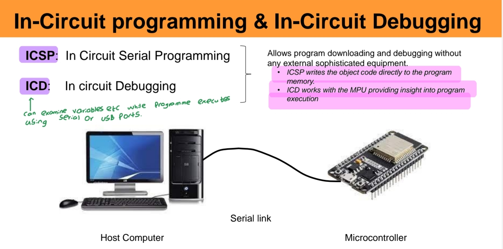

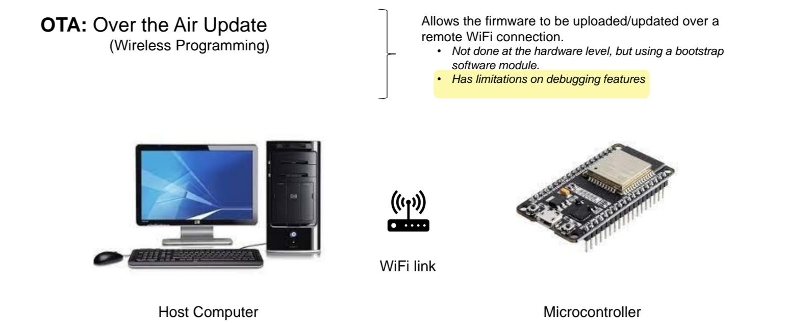

## 5. Microcontroller programming

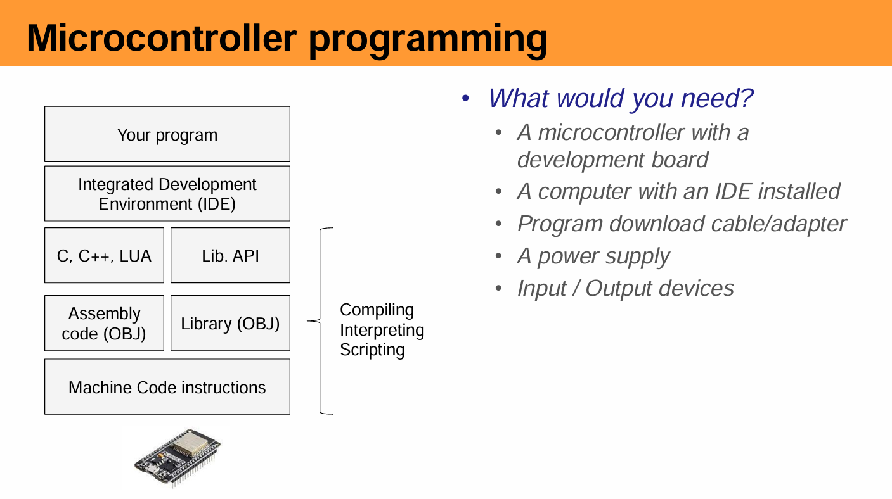

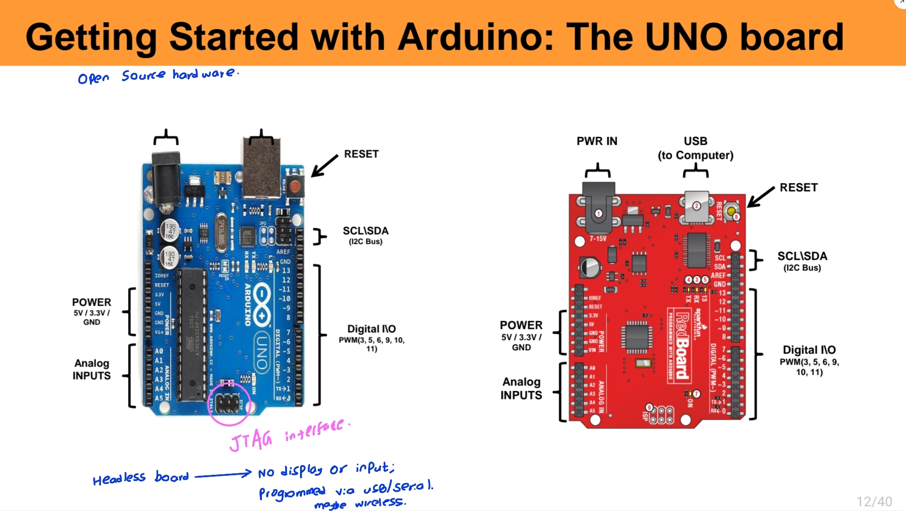

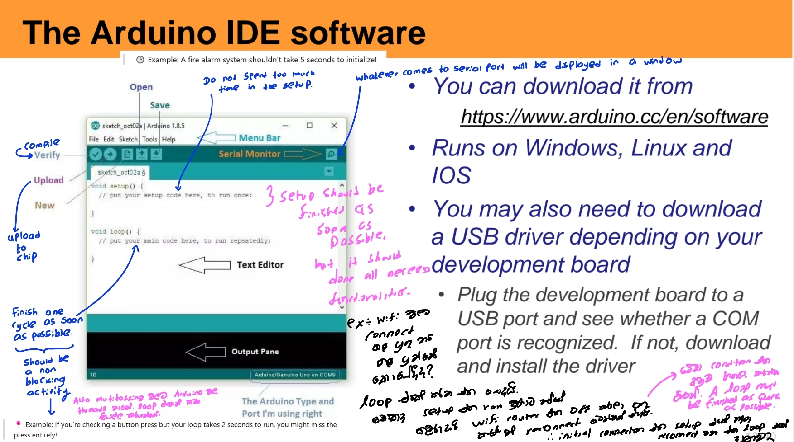

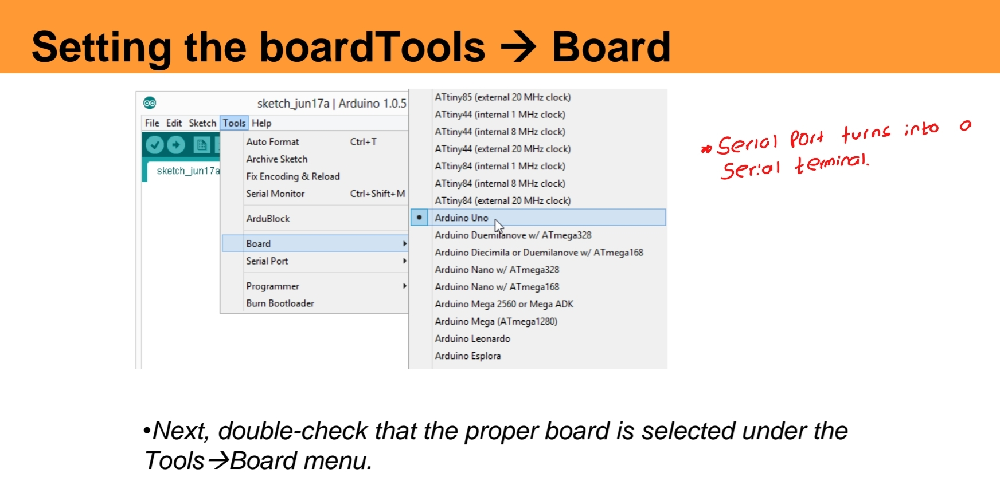

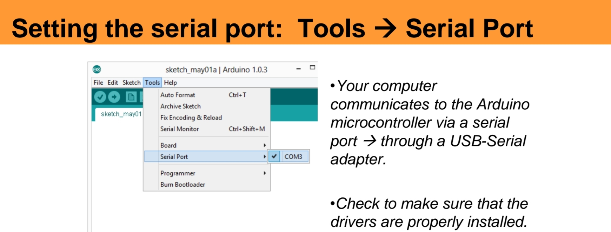

