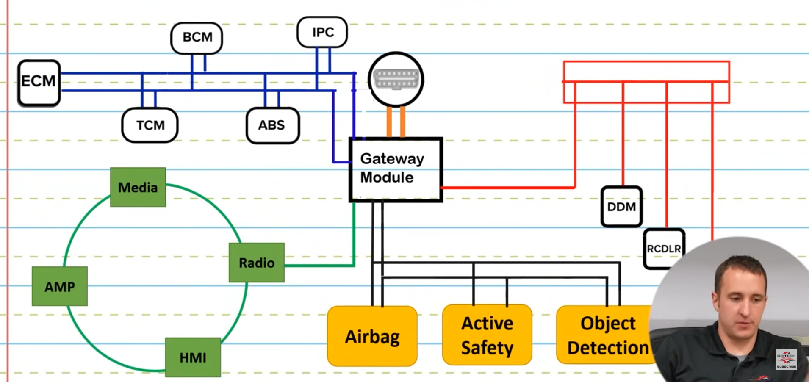

Now they work together to create systems

ALDL, which stands for Assembly Line Diagnostic Link

Modern network today

4 canbuses. each one may can speak with different languages. Gateway module is responsible for intepreting.

 